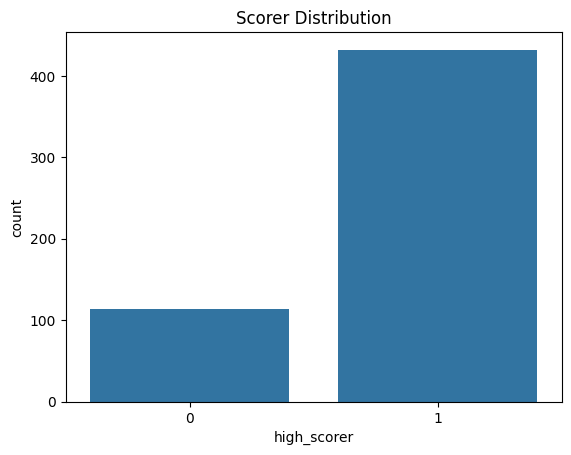
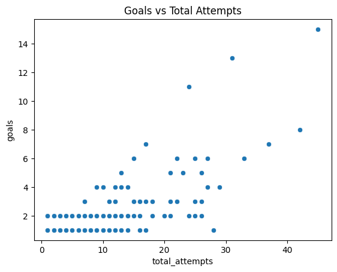
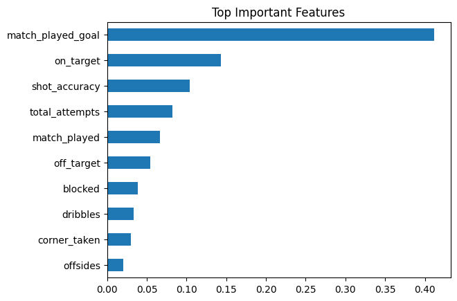

# UCL Player Goal Predictor

Predicting **high-scoring UEFA Champions League players** with machine learning using attacking and shot-based statistics.


---

## Project Summary

This project builds a binary classifier to predict whether a player is a:
- `1` -> **High Scorer** (goals >= 70th percentile)
- `0` -> **Low Scorer**

using only pre-goal style features such as:
- `total_attempts`, `on_target`, `off_target`, `blocked`
- attacking contribution (`assists`, `dribbles`, `offsides`)
- engineered feature: `shot_accuracy`

The final comparison shows **tree-based models (Random Forest, XGBoost) outperform Logistic Regression**.

---

## Project Snapshot

- **Domain:** Football analytics (UEFA Champions League)
- **Task:** Binary classification
- **Players after merge/cleaning:** ~546
- **Models:** Logistic Regression, Random Forest, XGBoost
- **Notebook:** `notebooks_UCL_Goal_Predictor_UCL_Player_GoalPredictor.ipynb`
- **Poster files:** `UCL_Goal_Prediction_E-Poster.html`, `e-poster.html`

---

## Dataset

Source: [Kaggle - UCL 2021/22 UEFA Champions League Player Stats](https://www.kaggle.com/datasets/azminetoushikwasi/ucl-202122-uefa-champions-league)

Files used in this repository:
- `attacking.csv` (~176 rows)
- `attempts.csv` (~546 rows)
- `goals.csv` (~183 rows)

---

## Workflow

1. **Data cleaning and normalization**
   - standardize column names and player keys
   - merge attempts, goals, and attacking datasets
   - handle missing values and remove duplicates

2. **Feature engineering**
   - create `shot_accuracy = on_target / max(total_attempts, 1)`
   - prepare final feature set for training

3. **Leakage prevention**
   - remove direct goal-revealing fields (target leakage)

4. **Training and evaluation**
   - train/test split: 80/20 (`random_state=42`)
   - evaluate Logistic Regression, Random Forest, and XGBoost
   - compare accuracy + confusion matrix + feature importance

---

## Model Results

Notebook-reported accuracy:
- **Logistic Regression:** `0.7818`
- **Random Forest:** `0.9000`
- **XGBoost:** `0.9182`

Interpretation:
- Logistic Regression provides a good linear baseline.
- Random Forest improves performance significantly.
- XGBoost gives the best score in this run.

---

## Visual Insights

### 1) Target Class Distribution

Class imbalance exists (low scorers dominate), which can influence model behavior.

### 2) Goals vs Total Attempts

Players with more attempts generally tend to score more goals (positive trend).

### 3) Feature Importance (Random Forest)

Key drivers include shot-related and match-participation features.

---

## Repository Structure

```text
UCL goal predictor/
|- attacking.csv
|- attempts.csv
|- goals.csv
|- notebooks_UCL_Goal_Predictor_UCL_Player_GoalPredictor.ipynb
|- UCL_Goal_Prediction_E-Poster.html
|- e-poster.html
|- high_scorer_distribution.png
|- goals_vs_attempts.png
|- feature_importance.png
|- README.md
```

---

## Run Locally

1) Create virtual environment
```bash
python -m venv .venv
.venv\Scripts\activate
```

2) Install dependencies
```bash
pip install pandas numpy matplotlib seaborn scikit-learn xgboost jupyter
```

3) Launch notebook
```bash
jupyter notebook
```

Then open:
`notebooks_UCL_Goal_Predictor_UCL_Player_GoalPredictor.ipynb`

---

## Poster and PDF Export

- `UCL_Goal_Prediction_E-Poster.html`: full poster design
- `e-poster.html`: compact single-page A4 landscape poster

To export PDF from `e-poster.html`:
1. Open file in Chrome/Edge.
2. Press `Ctrl + P`.
3. Set:
   - Paper: **A4**
   - Orientation: **Landscape**
   - Margins: **None**
   - Scale: **100%** (or Fit to page)
4. Save as PDF.

---

## Tech Stack

- Python
- Pandas, NumPy
- Matplotlib, Seaborn
- scikit-learn
- XGBoost
- HTML/CSS (poster layout and print formatting)

---

## Author

**Aryan Dev Tyagi**  
Course: **BCAI-601-MLT - Machine Learning Techniques (2025-26)**

